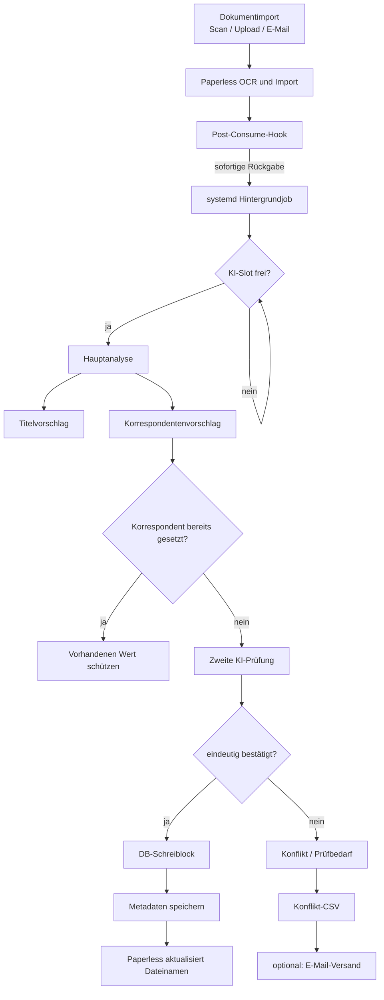

# Paperless-ngx KI-Automation

Automatische KI-Nachbearbeitung für **Paperless-ngx** über ein Post-Consume-Skript.

Die Lösung analysiert neu importierte Dokumente nach erfolgreicher Paperless-Verarbeitung, erzeugt einen sinnvollen deutschen Dokumenttitel, ermittelt konservativ den tatsächlichen Korrespondenten, prüft neue Zuordnungen ein zweites Mal und lässt Paperless anschließend den Dateinamen anhand der gesetzten Metadaten aktualisieren.

Die Verarbeitung läuft **asynchron** und kann mehrere KI-Jobs parallel ausführen. Manuell gesetzte Titel und Korrespondenten werden geschützt. Das Dokumentdatum wird bewusst **nie automatisch geändert**.

> **Referenzstand:** Skriptversion 4.5, Paperless-ngx 3.x, Installation unter `/opt/paperless`, persistente Daten unter `/opt/paperless_data`.

## Funktionen

- automatische Titelgenerierung für Scan-/Importtitel
- Schutz sinnvoller vorhandener Titel
- konservative Korrespondentenerkennung
- zweite unabhängige KI-Prüfung vor neuer Korrespondentenzuordnung
- vorhandene Korrespondenten werden niemals automatisch überschrieben
- Fuzzy-Matching gegen bestehende Korrespondenten
- Erkennung mehrdeutiger Mehrfach-Korrespondenten
- automatische Neuanlage eindeutig bestätigter Korrespondenten
- Datumserkennung nur zur Kontrolle, **keine automatische Datumsänderung**
- asynchroner Post-Consume-Hook
- bis zu drei parallele KI-Jobs
- serialisierte Datenbank-Schreibphase gegen konkurrierende Neuanlagen
- Dry-Run-Modus
- gezielte Verarbeitung einzelner Dokument-IDs
- manueller Batch-Betrieb
- Konflikt-CSV nur für Fälle mit Prüfbedarf
- optionaler Versand der Konflikt-CSV per SMTP
- E-Mail-importierte Dokumente laufen durch denselben Post-Consume-Prozess

## Ablauf



## Repository-Struktur

```text
paperless-ngx-ai-automation/
├── scripts/
│   ├── paperless_ai_recheck.py
│   ├── paperless-ai-worker.sh
│   ├── paperless-ai-post-consume.sh
│   ├── paperless-ai-batch-parallel.sh
│   └── check.sh
├── config/
│   ├── paperless.conf.example
│   └── paperless-ai-mail.conf.example
├── docs/
├── .github/
├── install.sh
├── uninstall.sh
├── VERSION
├── LICENSE
└── README.md
```

## Schnellstart

### 1. Dateien ablegen

```bash
mkdir -p /opt/paperless_data/scripts
./install.sh
```

```bash
chmod 640 /opt/paperless_data/scripts/paperless_ai_recheck.py
chmod 750 /opt/paperless_data/scripts/paperless-ai-worker.sh
chmod 750 /opt/paperless_data/scripts/paperless-ai-post-consume.sh
```

### 2. Paperless konfigurieren

In `/opt/paperless/paperless.conf`:

```ini
PAPERLESS_POST_CONSUME_SCRIPT=/opt/paperless_data/scripts/paperless-ai-post-consume.sh
AI_POST_CONSUME_APPLY=0
```

Danach die relevanten Dienste neu starten:

```bash
systemctl restart paperless-task-queue paperless-consumer
```

### 3. Dry-Run testen

```bash
DOCUMENT_ID=23 AI_POST_CONSUME_APPLY=0 /opt/paperless_data/scripts/paperless-ai-post-consume.sh
```

Log:

```bash
tail -f /opt/paperless_data/data/log/paperless-ai-post-consume.log
```

Erwartet wird unter anderem:

```text
DOCUMENT_ID=23
APPLY=0
SLOT=1
...
Dokumente: 1
...
DRY-RUN
```

### 4. Automatik aktivieren

Nach erfolgreichem Test:

```ini
AI_POST_CONSUME_APPLY=1
```

Danach:

```bash
systemctl restart paperless-task-queue paperless-consumer
```

## Sicherheitsprinzipien

Die Automatik folgt bewusst konservativen Regeln:

1. **Vorhandener Korrespondent hat Vorrang.**
2. **Sinnvoller vorhandener Titel bleibt geschützt.**
3. **Neue Korrespondenten benötigen eine zweite KI-Bestätigung.**
4. **Mehrdeutige KI-Ergebnisse werden nicht automatisch übernommen.**
5. **Das Dokumentdatum wird nie automatisch verändert.**
6. **Technische Fehler stoppen nicht die Verarbeitung anderer Dokumente.**
7. **SMTP-Fehler beeinflussen die Dokumentänderung nicht.**

## Dokumentation

- [Installation](docs/INSTALLATION.md)
- [Konfiguration](docs/CONFIGURATION.md)
- [Funktionsweise und Entscheidungslogik](docs/LOGIC.md)
- [Parallelisierung](docs/PARALLELISM.md)
- [Konflikt-CSV und E-Mail-Bericht](docs/REPORTING.md)
- [E-Mail-Import](docs/EMAIL_IMPORT.md)
- [Betrieb und Nutzung](docs/USAGE.md)
- [Fehlerbehebung](docs/TROUBLESHOOTING.md)
- [Sicherheit](SECURITY.md)
- [Updates](docs/UPDATES.md)
- [Changelog](CHANGELOG.md)
- [Projektgeschichte von v1 bis v4.5](docs/HISTORY.md)
- [Versionsmatrix](docs/VERSION_MATRIX.md)
- [Regressionstests](docs/REGRESSION_TESTS.md)
- [Migration von älteren Versionen](docs/MIGRATION.md)

## Offizielle Referenzen

- Paperless-ngx: Post-Consumption Scripts  
  https://github.com/paperless-ngx/paperless-ngx/blob/dev/docs/advanced_usage.md
- Paperless-ngx: Konfiguration  
  https://github.com/paperless-ngx/paperless-ngx/blob/dev/docs/configuration.md
- OpenAI: Modelle  
  https://developers.openai.com/api/docs/models
- OpenAI: API-Preise  
  https://developers.openai.com/api/docs/pricing

## Projektgeschichte

Die Automatisierung entstand schrittweise aus einem zunächst einfachen KI-Batchlauf. Mehrere reale Fehlklassifikationen führten dazu, die Logik von Version zu Version konservativer und robuster aufzubauen.

Kurzfassung:

```text
v1   einfacher KI-Batch, noch mit unsicherer Datumsautomatik
v2   Datum gesperrt, Titel-/Korrespondentenregeln verbessert
v3   starke Schutzlogik und konservatives Matching
v4.0/v4.1 zweite unabhängige Korrespondentenprüfung
v4.2 Mehrdeutigkeits- und Klammerlogik verbessert
v4.3 asynchrone und parallele Verarbeitung
v4.4 CSV nur noch für echte Prüffälle
v4.5 Konfliktbericht optional per E-Mail
```

Die vollständige Entwicklung ist unter [Projektgeschichte](docs/HISTORY.md) dokumentiert.

## Hinweis

Dieses Projekt ist eine eigenständige Erweiterung und kein offizieller Bestandteil von Paperless-ngx oder OpenAI.

## Lizenz

MIT – siehe [LICENSE](LICENSE).
