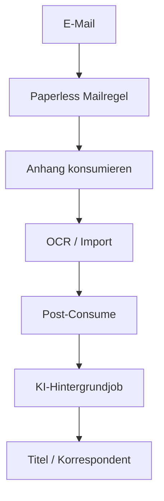

# E-Mail-Import

Paperless-ngx kann E-Mail-Konten abrufen und passende Anhänge anhand von Mail-Regeln konsumieren.

## Wichtig

Ein eingerichtetes Mailkonto allein importiert noch keine Anhänge.

Es muss mindestens eine passende Mail-Regel existieren.

## Ablauf mit KI-Automation



E-Mail-Anhänge durchlaufen nach erfolgreichem Konsum denselben Post-Consume-Hook wie Scanner-, Upload- oder Consume-Verzeichnis-Dokumente.

## Empfehlung für Mail-Regeln

Wenn die KI Titel und Korrespondent bestimmen soll, sollten Mail-Regeln diese Felder möglichst nicht unnötig vorab festlegen.

Sinnvoll können dagegen sein:

- Tags
- Dokumenttyp
- Besitzer
- Speicherpfad

## Abrufintervall

Paperless verwendet:

```ini
PAPERLESS_EMAIL_TASK_CRON=*/10 * * * *
```

als Standardintervall von zehn Minuten.

Beispiel alle zwei Minuten:

```ini
PAPERLESS_EMAIL_TASK_CRON=*/2 * * * *
```

Nach Änderung müssen die für Scheduler/Task-Queue relevanten Paperless-Dienste die Konfiguration neu laden.

Offizielle Referenz:

https://github.com/paperless-ngx/paperless-ngx/blob/dev/docs/configuration.md

## Warum die KI später sichtbar sein kann

Der Post-Consume-Hook startet die KI asynchron.

Daher kann folgende Situation normal sein:

```text
09:00:00 Dokument erscheint in Paperless
09:00:01 Post-Consume startet KI
09:00:10 KI-Slot wird frei
09:00:14 Titel/Korrespondent werden aktualisiert
```

Das ist kein Fehler, solange der KI-Worker anschließend im Log erscheint.
