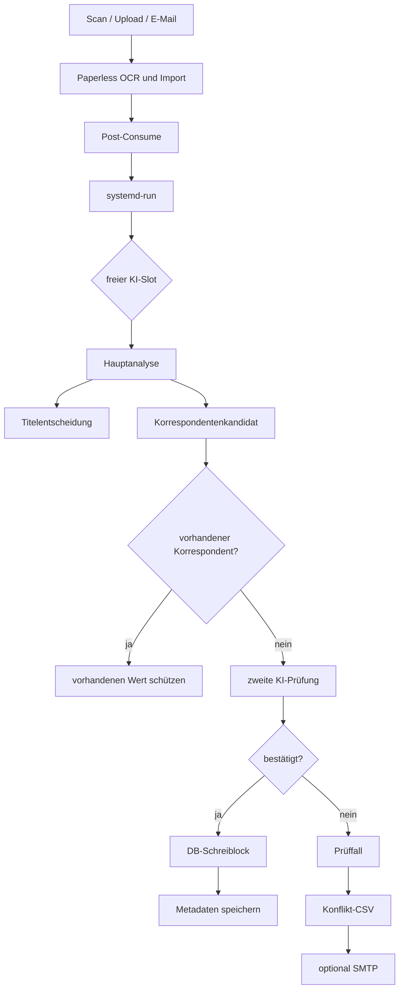

# Projektgeschichte

## Ausgangslage

Die ersten Dokumente in Paperless waren bereits OCR-verarbeitet, trugen aber häufig technische oder wenig aussagekräftige Titel wie:

```text
scan_22-06-2022-161118
scan_21-05-2023-095748
scan_2026_08_14T14_43_25
```

Ziel war zunächst, vorhandene Dokumente automatisch durch ein LLM prüfen zu lassen und daraus bessere Metadaten zu erzeugen.

Die ursprüngliche Idee war einfach:

```text
OCR-Text
→ KI
→ Titel
→ Korrespondent
→ Datum
→ speichern
```

In der Praxis zeigte sich schnell, dass gerade Dokumentdatum und Korrespondent nicht zuverlässig genug für eine ungeschützte Vollautomatik sind.

---

## Phase 1 – Der erste Batch-Prototyp

Die erste Version war ein klassischer Batchlauf über alle vorhandenen Dokumente.

Sie konnte:

- Dokumente aus der Paperless-Datenbank lesen
- OCR-Inhalt an Paperless' `AIClient` geben
- Titel, Korrespondenten und Datumswerte auswerten
- Änderungen im Dry-Run darstellen
- ein CSV-Protokoll erzeugen
- später auch tatsächlich speichern

Das war technisch erfolgreich, aber fachlich noch zu aggressiv.

### Erste Erkenntnis: Ein KI-Datum ist nicht automatisch das gewünschte Paperless-Datum

Bei historischen Dokumenten erkannte das Modell teils ein tatsächlich im Dokument vorhandenes älteres Datum.

Beispiel:

```text
Dokument: Prüfungsbescheinigung
Paperless-Datum: 2022-06-22
KI-Datum:        2002-07-13
```

Das KI-Datum konnte der echte Prüfungstag sein. Trotzdem war nicht eindeutig, ob es genau das Datum war, das im Archiv als primäres Dokumentdatum geführt werden sollte.

Daraus entstand eine bis heute geltende Regel:

> **Die KI darf Datumswerte erkennen und melden, aber nie automatisch das Dokumentdatum ändern.**

---

## Phase 2 – Schutz bestehender Metadaten

Version 2 änderte den Charakter des Projekts.

Aus einer möglichst vollständigen Automatisierung wurde eine **vorsichtige Metadatenverbesserung**.

Titel wurden nur noch automatisch ersetzt, wenn sie erkennbar technisch oder generisch waren.

Beispiele:

```text
scan_...
IMG_...
Originaldateiname == Titel
```

Sinnvolle vorhandene Titel blieben erhalten.

Auch Korrespondenten wurden stärker gegen vorhandene Paperless-Einträge abgeglichen.

Ein Dry-Run konnte neu zu erzeugende Korrespondenten bereits virtuell vormerken. Dadurch konnte ein späteres Dokument im selben Lauf denselben simulierten Korrespondenten wiederverwenden.

---

## Phase 3 – Konservative Korrespondentenlogik

Die nächste große Erkenntnis war, dass **ein semantisch ähnlicher Name nicht automatisch dieselbe Organisation bedeutet**.

Ein wichtiges Beispiel:

```text
Stadt Porta Westfalica
```

gegen:

```text
Stadtwerke Porta Westfalica GmbH
```

Ein zu großzügiges Substring-Matching wäre hier fachlich falsch.

Version 3 führte deshalb ein deutlich strengeres Matching ein:

```text
Fuzzy-Schwelle: 0.93
```

Zusätzlich wurden Rechtsformen normalisiert, ohne die eigentliche Organisationsidentität zu verwischen.

### Vorhandene Korrespondenten werden geschützt

Ein weiterer Testfall:

```text
Dokument: Arbeitnehmerkündigung
vorhandener Korrespondent: Geldgeier GmbH
KI-Vorschlag: Max Mustermann
```

Obwohl die KI aus Dokumentperspektive nachvollziehbar den Absender erkannte, sollte eine bereits manuell gesetzte Paperless-Zuordnung nicht überschrieben werden.

Daraus entstand die bis heute gültige Regel:

> **Ein vorhandener Korrespondent hat immer Vorrang vor einer späteren KI-Einschätzung.**

### Mehrfachorganisationen

Ein einzelner String kann mehrere Organisationen enthalten:

```text
ARD, ZDF, Deutschlandradio
```

Solche Ergebnisse werden nicht automatisch als neuer Korrespondent gespeichert.

---

## Phase 4 – Die zweite KI-Prüfung

Nach Version 3 blieb eine besonders gefährliche Fehlerklasse übrig:

> Die KI nennt genau **einen** Korrespondenten, der plausibel klingt, aber trotzdem fachlich falsch ist.

Drei reale Problemklassen waren entscheidend:

### Lohnsteuerbescheinigung

Eine Krankenkasse kann im Dokument auftauchen, obwohl sie nicht der Aussteller ist.

### Medizinisches Dokument

Ein Hersteller eines EKG-Geräts kann prominent im OCR-Text stehen, obwohl der eigentliche Aussteller eine Arztpraxis ist.

### OCR-Fehler

Ein Organisationsname kann so falsch gelesen werden, dass ein neuer fehlerhafter Korrespondent angelegt würde.

Deshalb wurde in Version 4.1 ein zweiter, separater LLM-Aufruf eingeführt.

Ablauf:

```text
Hauptanalyse
→ Kandidat
→ zweite Prüfung gegen denselben OCR-Text
→ nur bei Bestätigung übernehmen
```

Der Verifikationsprompt fragt ausschließlich:

> Ist dieser Kandidat wirklich der tatsächliche Aussteller oder Absender dieses konkreten Dokuments?

Ausdrücklich nicht bestätigen soll die zweite Prüfung unter anderem:

- nur erwähnte Firmen
- Empfänger
- Gerätehersteller
- bloße Vertragspartner
- fremde Versicherer/Krankenkassen
- Organisationen in Anlagen
- OCR-verdächtige Namen

### Atomisches Speichern

Neue Korrespondenten werden seitdem möglichst im selben Datenbankvorgang wie die Dokumentänderung erzeugt.

Damit soll verhindert werden, dass ein neuer Korrespondent angelegt wird, das Dokument aber anschließend nicht gespeichert werden kann.

---

## Phase 5 – Kleine Regeln aus realen Fehlerfällen

Version 4.2 entstand aus einem kleinen, aber typischen Randfall.

Die Mehrfacherkennung sah:

```text
Kaufland (Filiale 3970, Herford)
```

und interpretierte das Komma als mehrere Organisationen.

Die Logik wurde deshalb geändert:

- Kommata **außerhalb** von Klammern können Mehrfachorganisationen signalisieren
- Kommata **innerhalb** von Klammern werden dafür ignoriert

Diese Art von Änderung ist typisch für das Projekt: reale Dokumente werden als Regressionstests verwendet.

---

## Phase 6 – Geschwindigkeit und Post-Consume

Mit stärkerer KI und zweiter Verifikation wurde der serielle Batchlauf langsam.

Gleichzeitig entstand der Wunsch, neu eingescannte Dokumente automatisch zu bearbeiten.

Paperless bietet dafür offiziell einen Post-Consume-Hook.

Der erste synchrone Entwurf hatte jedoch einen Nachteil:

```text
Paperless importiert
→ Post-Consume startet KI
→ Paperless wartet
→ KI fertig
→ Hook endet
```

Da einzelne KI-Läufe lange dauern können, wurde der Hook anschließend asynchronisiert.

Heute:

```text
Paperless importiert
→ Post-Consume startet systemd-Hintergrundjob
→ Hook endet sofort
→ KI läuft unabhängig weiter
```

Ein gemessener Hook-Aufruf lag beispielsweise bei nur wenigen Zehntelsekunden bzw. darunter.

### Parallele KI-Worker

Die LLM-Aufrufe sind überwiegend Netzwerk- und API-Latenz.

Deshalb dürfen mehrere Dokumente parallel analysiert werden.

Der aktuelle Aufbau nutzt bis zu drei Slots:

```text
Slot 1
Slot 2
Slot 3
```

Nur die kurze DB-Schreibphase bleibt global serialisiert.

---

## Phase 7 – Von Vollprotokoll zu Arbeitsbericht

Die erste CSV enthielt praktisch jeden verarbeiteten Fall.

Das war für Entwicklung und Dry-Runs nützlich, für den Dauerbetrieb aber unübersichtlich.

Version 4.4 änderte die Bedeutung der CSV:

> Die CSV ist kein vollständiges Ablaufprotokoll mehr, sondern eine **Liste der manuellen Prüffälle**.

Sie enthält nur noch:

- Mehrdeutigkeit
- Konflikte
- verworfene zweite Prüfungen
- fehlende sichere Zuordnung
- technische Fehler

Erfolgreiche Routinefälle werden nicht mehr aufgenommen.

---

## Phase 8 – Konflikte per E-Mail

Der letzte Schritt bis v4.5 war organisatorisch:

Wenn die Automatik bereits selbst weiß, welche Fälle unsicher sind, sollte der Benutzer nicht regelmäßig auf dem Server nach CSV-Dateien suchen müssen.

Seit v4.5 kann der Prüfbericht automatisch per SMTP versendet werden.

Dabei gilt:

```text
0 Prüffälle
→ keine Mail

>= 1 Prüffall
→ CSV erzeugen
→ CSV per Mail senden
```

Ein Mailfehler darf niemals bereits erfolgreich gespeicherte Paperless-Metadaten zurückrollen.

---

## Aktuelle Architektur



---

## Leitprinzipien, die aus der Entwicklung entstanden sind

### 1. Manuelle Entscheidungen haben Vorrang

Ein vorhandener Titel oder Korrespondent wird nicht leichtfertig überschrieben.

### 2. Fehlende Daten sind besser als falsche Daten

Bei Unsicherheit bleibt ein Korrespondent leer.

### 3. Datum ist besonders schützenswert

Das LLM kann ein Datum korrekt lesen und trotzdem das fachlich falsche Datum für den Archivzweck auswählen.

### 4. Ein LLM-Aufruf ist kein Beweis

Deshalb wird ein neuer Korrespondent bei Bedarf noch einmal separat geprüft.

### 5. Geschwindigkeit darf Schutzlogik nicht ersetzen

Parallelisiert werden die langsamen LLM-Aufrufe. Die kritische Schreibphase bleibt geschützt.

### 6. Der Dauerbetrieb braucht andere Logs als die Entwicklung

Im Produktivbetrieb interessieren vor allem die Fälle, bei denen ein Mensch entscheiden muss.
