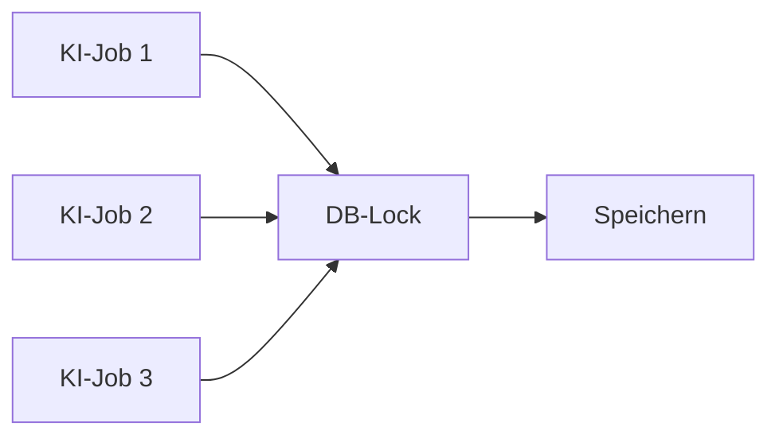

# Parallelisierung

## Grundidee

Die langsamen LLM-Abfragen dürfen parallel laufen.

Die kurze Datenbank-Schreibphase wird dagegen serialisiert.



## KI-Slots

Der Worker stellt bis zu drei globale Slots bereit:

```text
/run/paperless-ai-slot-1.lock
/run/paperless-ai-slot-2.lock
/run/paperless-ai-slot-3.lock
```

Sind alle Slots belegt, wartet ein neuer Hintergrundjob auf einen freien Slot.

## DB-Lock

Die Python-Anwendung verwendet:

```text
/run/paperless-ai-db-write.lock
```

Der Lock umfasst nur die eigentliche Schreibphase.

Dadurch können mehrere LLM-Abfragen gleichzeitig laufen, während konkurrierende Neuanlagen möglichst vermieden werden.

## Warum nicht alles sperren?

Ein globaler Lock über den gesamten Prozess würde folgende Reihenfolge erzwingen:

```text
Dokument A komplett
→ Dokument B komplett
→ Dokument C komplett
```

Das wäre sicher, aber unnötig langsam.

Mit getrenntem DB-Lock:

```text
A analysiert ───────┐
B analysiert ───────┼→ kurze serielle Schreibphasen
C analysiert ───────┘
```

## Post-Consume ist asynchron

`paperless-ai-post-consume.sh` startet den eigentlichen Worker über `systemd-run`.

Dadurch wartet Paperless nicht auf die LLM-Antwort.

Das Dokument kann bereits in Paperless sichtbar sein, während Titel und Korrespondent noch nachbearbeitet werden.

## Überwachung

Aktive KI-Systemd-Jobs:

```bash
systemctl list-units --type=service 'paperless-ai-*'
```

Log:

```bash
tail -f /opt/paperless_data/data/log/paperless-ai-post-consume.log
```

Im Log ist der Slot sichtbar:

```text
DOCUMENT_ID=123
APPLY=1
SLOT=2
```

## Paperless-OCR-Parallelität

Die KI-Slots sind unabhängig von Paperless' eigenen OCR-Workern.

Beispiel bei sechs CPU-Kernen:

```ini
PAPERLESS_TASK_WORKERS=3
PAPERLESS_THREADS_PER_WORKER=2
```

Die LLM-Aufrufe selbst benötigen lokal vergleichsweise wenig CPU, können aber Netzwerk- und API-Latenz verursachen.
